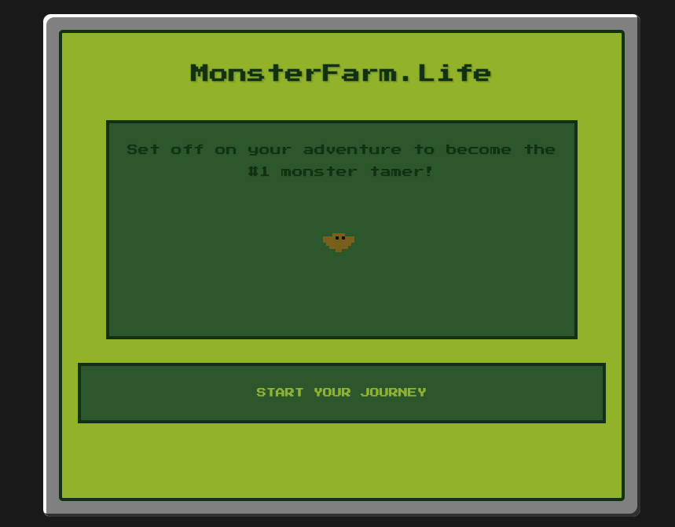
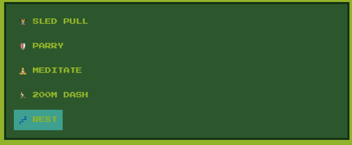
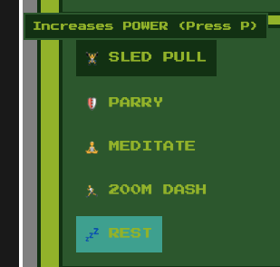
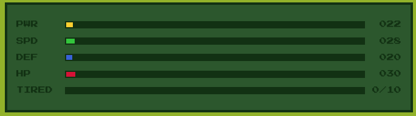
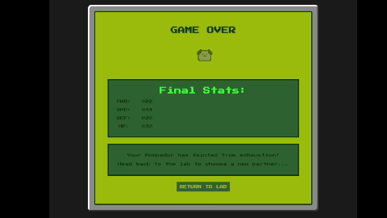
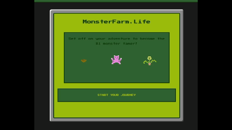
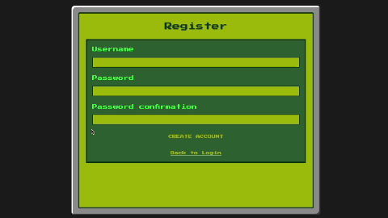
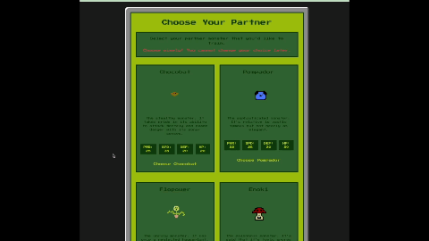

# MonsterFarm.Life 🎮

A retro-style monster training simulator where you can raise and train different monsters, built with Ruby on Rails featuring a GameBoy-inspired interface.

## Features

### Character Creation
- Create an account with a unique username
- Choose between 6 unique starter monsters:
  - **Chocobat** (High Power/Speed) - A stealthy monster with sonar senses
  - **Flopower** (High Power/Defense) - Former houseplant turned monster
  - **Galoot** (Balanced) - Mysterious creature with unknown potential
  - **Pompador** (Moderate Attacker) - Sophisticated relative of a famous monster
  - **Enoki** (High Health) - Poisonous monster with medicinal properties
  - **Shinka** (Strong Overall) - Monster with army-like vitality

### Training System

Four different training exercises available:
- **Sled Pull**: Increases Power stat (1-5 points)
- **Parry**: Improves Defense stat (1-5 points)
- **Meditate**: Enhances Health stat (1-7 points)
- **200M Dash**: Boosts Speed stat (1-5 points)

Each training attempt has:
- 85% success rate
- Increases tiredness by 1 if successful
- Increases tiredness by 2 if failed

### Keyboard Shortcuts

Train your monster faster with keyboard shortcuts:
- **P**: Sled Pull (Power training)
- **D**: Parry (Defense training)
- **S**: 200M Dash (Speed training)
- **H**: Meditate (Health training)
- **R**: Rest your monster

### Stats System

All monsters have five stats:
- Power (PWR)
- Speed (SPD)
- Defense (DEF)
- Health (HP)
- Tiredness

Stats have these properties:
- Maximum stat value is 999
- Maximum tiredness is 10
- Monster faints when tiredness reaches 10

- Rest option reduces tiredness by 1-2 points

## How to Run the Game

### Requirements
Before starting, make sure you have these installed:
- Ruby version 3.2.0
- Rails version 7.0 or higher
- SQLite3 database

### Step-by-Step Setup

1. **Clone the Repository**
- git clone https://github.com/akonisanchez/monster_farm.life.git
- cd monster_farm.life
2. **Install Ruby Dependencies**
- bundle install
3. **Set Up the Database**
- rails db:create
- rails db:migrate
4. **Start the Game**
- rails server
5. **Access the Game**
- Open your web browser
- Go to: 'http://localhost:3000'

## Playing the Game

### 1. Getting Started
- Click "Start Your Journey" on the welcome page
  

- Create an account with a username and password

- Select your starter monster

### 2. Training Your Monster
- Use training buttons to increase stats
- Watch the stat bars grow with successful training
- Rest your monster when tiredness gets high
- If your monster faints (10 tiredness), you'll need to choose a new one

### 3. Tips for Success
- Balance training with rest
- Each monster has different strengths - choose training that complements them
- Watch the tiredness meter carefully

### 4. Future Updates
- Inventory feature
- Gold feature
- Expeditions: Take your monster on expeditions in search of gold and items!
- Battles: Test your monster's strength against other monsters!
