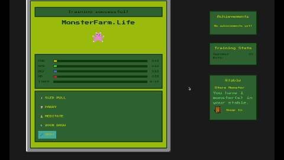
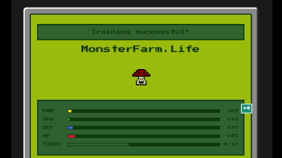
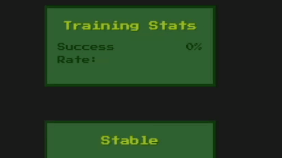
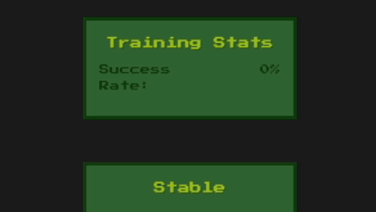
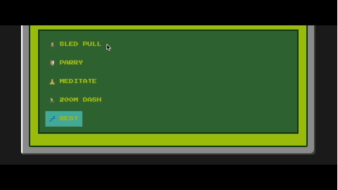
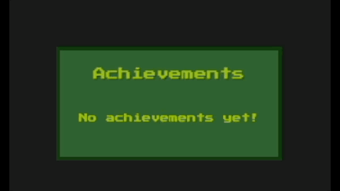
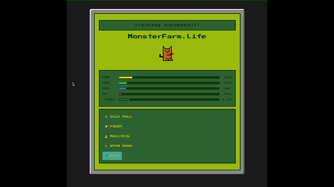

# MonsterFarm.Life 🎮

A retro-style monster training simulator where you can raise and train different monsters, built with Ruby on Rails featuring a GameBoy-inspired interface.

## Technical Stack

This application is built with:

### Backend
- Ruby 3.2.0
- Ruby on Rails 7.0
- SQLite3 (Database)
- BCrypt (Pw Encryption)

### Frontend
- HTML5
- CSS3
- ERB (Embedded Ruby Templates)
- Javascript (for interactive features like keyboard shortcuts)

## Features

### Character Creation
- Create an account with a unique username
- Choose between 6 unique starter monsters:
  - **Chocobat** (High Power/Speed) - A stealthy monster with sonar senses
  - **Flopower** (High Power/Defense) - Former houseplant turned monster
  - **Galoot** (Balanced) - Mysterious creature with unknown potential
  - **Pompador** (Moderate Attacker) - Sophisticated relative of a famous monster
  - **Enoki** (High Health) - Poisonous monster with medicinal properties
  - **Shinka** (Strong Overall) - Monster with army-like vitality

### Monster Storage

-Each user can have 1 active monster and store up to 2 monsters in their stable
-Users can swap their active monster with a monster in storage at any time

### Stats System

All monsters have five stats:
- Power (PWR)
- Speed (SPD)
- Defense (DEF)
- Health (HP)
- Tiredness

Stats have these properties:
- Maximum stat value is 999
- Maximum tiredness is 10
- Monster faints when tiredness reaches 10
  
### Training System

Four different training exercises available:
- **Sled Pull**: Increases Power stat (1-5 points)
- **Parry**: Improves Defense stat (1-5 points)
- **Meditate**: Enhances Health stat (1-7 points)
- **200M Dash**: Boosts Speed stat (1-5 points)

Each training attempt has:
- 75% success rate
- If succesful, increases tiredness by 1 
- If unsuccesful, increases tiredness by 2 

#### New Training Features (Added January 2025)

-**Feeling Good Bonus:**
Occasionally, your monster will **"feel good,"** gaining an extra boost in confidence.
On the next succesful training attempt, it will receive a larger stat increase bonus ranging from **+10 to +25 points.**

-**Hot Streak System:**

Your monster can enter a **hot streak** after succeeding in **5 consecutive drills.** 
While on a hot streak, the next few training attempts will have an **increased success rate**,
but the success rate will gradually return to normal over time.

-**Training Logs:**

Keeps track of most recent drill results, calculates your average training success rate, and determines your most succesful drill!

-**Time-based Bonuses:**

Your monster will receive larger stat bonuses for various drills based on the time of day!

### Keyboard Shortcuts

Train your monster faster with these Javascript-based keyboard shortcuts. Users can press specific keys to trigger actions:

- **P**: Sled Pull (Power training)
- **D**: Parry (Defense training)
- **S**: 200M Dash (Speed training)
- **H**: Meditate (Health training)
- **R**: Rest your monster
- Rest option reduces tiredness by 1-2 points

### Achievement System (Added January 2025)
Track your monster's growth with unlockable achievements:

#### Stat Achievements
- **Apprentice Tier** (50 in a stat)
  - Power Apprentice
  - Speed Apprentice
  - Yoga Apprentice (Health)
  - Tank Apprentice (Defense)

- **Pro Tier** (200 in a stat)
  - Power Pro
  - Speed Pro
  - Yoga Pro
  - Tank Pro

- **Master Tier** (999 in a stat)
  - Power Prodigy
  - Speed Demon
  - Nirvanic Yogi
  - Indomitable Tank

#### Special Achievements
- **Training Expert**: Complete 100 successful training sessions
- **Hot Streak Master**: Trigger hot streak 5 times
- **Streaker**: Complete 10 successful trainings in a row
  
## How to Run the Game

### Requirements
Before starting, make sure you have these installed:
- Ruby version 3.2.0
- Rails version 7.0 or higher
- SQLite3 database

### Step-by-Step Setup

1. **Clone the Repository**
- git clone https://github.com/akonisanchez/monster_farm.life.git
- cd monster_farm.life
2. **Install Ruby Dependencies**
- bundle install
3. **Set Up the Database**
- rails db:create
- rails db:migrate
- rails game:seed_achievements (required for achievement system)
- rails db:seed (Adds sample leaderboard data)
4. **Start the Game**
- rails server
5. **Access the Game**
- Open your web browser
- Go to: 'http://localhost:3000'

## Playing the Game

### 1. Getting Started
- Click "Start Your Journey" on the welcome page
  

- Create an account with a username and password

- Select your starter monster

### 2. Training Your Monster

- Use training buttons to increase stats
- Watch the stat bars grow with successful training
- Rest your monster when tiredness gets high
- If your monster faints (10 tiredness), you'll need to choose a new one

### 3. Tips for Success
- Balance training with rest
- Each monster has different strengths - choose training that complements them
- Watch the tiredness meter carefully

### 4. Future Updates
- Inventory feature
- Gold feature
- Expeditions: Take your monster on expeditions in search of gold and items!
- Battles: Test your monster's strength against other monsters!
